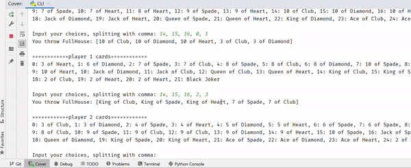
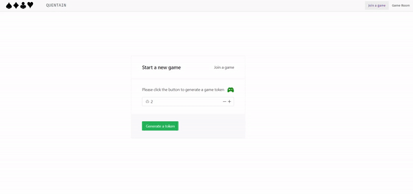

# Quentain
An implementation of the Poker Game Guandan popular among Jiangsu and Anhui in China


## Demo

A live demo is on at https://quentain.onrender.com. When prompted to enter the server address, use https://quentain-server.onrender.com.

## Dependency

Under `quentain-frontend`, run `npm install`

Under `quentain-server`, run `pip install -r requirements.txt`

## Deployment

For the deploy of the frontend, enter `quentain-frontend`, run

```
> npm install -g serve
> npm run build
```

The build result would be under `dist` directory. If you wish to run it locally, run `serve -s dist`.

For the deployment of the backend, use GUnicorn as the WSGI

```
> gunicorn app:app
```

## Rule
According to https://en.wikipedia.org/wiki/Guandan

## Coverage Test

Make sure `coverage` is installed, then use
```bash
coverage run test.py
```

## CLI version

A experimental CLI version is playable right now.

Run 
```bash
python  cli.py <-e/--exp>
```

The argument `-e` or `--exp` is to turn on the experimental debug version, where each player gets 4 cards instead of 27.



## Frontend UI

Make sure you install the latest version of `node`, `npm`. Install `vue` and `naive-ui` as well.

Under `frontend/quentain-frontend`, run

```bash
npm install
npm run dev
```

The current demo looks like this. The implementation is based on `HTML5 canvas`.



## Local server version

* To start game engine locally:

```bash
cd quentian-server
flask run --port=5050

# or
python app.py
```

* To start a new game (with level 2):
```bash
curl -X POST -H "Content-Type: application/json" -d '{"level": 2}' http://localhost:5050/new_game
```

* To join a game with token <token>:
```bash
curl -X POST http://localhost:5050/join_game/<token>
```

* To start a game with token <token>:
```bash
curl -X POST http://localhost:5050/start_game/<token>
# Note: a game can only be started after all four players have joined
```

* To check the current game state with token <token>:
```bash
curl http://localhost:5050/get_game_state/<token>
```

* To let player <player_number> throw cards in game with token <token>:
```bash
curl -X POST -H "Content-Type: application/json" -d '{"player_number":<player_number>, "choices": [<your choices, seperated by comma>]}' http://localhost:5050/throw_cards/<token>
```

## Test Local server version

Test game with four players locally:

First initialize a new game in one window and get the token:
```bash
curl -X POST -H "Content-Type: application/json" -d '{"level": 2}' http://localhost:5050/new_game
```
In each of four windows, run the following command:

```bash
python game_test.py
```

