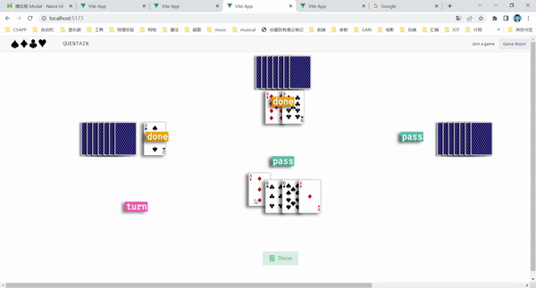

# Quentain
An implementation of the Poker Game Guandan popular among Jiangsu and Anhui in China

## Dependency

- `Node.js`: `vue`, `naive-ui`, `axios`
- `Python`: `flask`, `flask-cors`

## Rule
According to https://en.wikipedia.org/wiki/Guandan

## Coverage Test

Make sure `coverage` is installed, then use
```bash
coverage run test.py
```

## CLI version

A experimental CLI version is playable right now.

Run 
```bash
python  cli.py <-e/--exp>
```

The argument `-e` or `--exp` is to turn on the experimental debug version, where each player gets 7 cards instead of 27.


## Frontend UI

Make sure you install the latest version of `node`, `npm`. Install `vue` and `naive-ui` as well.

Under `frontend/quentain-frontend`, run

```bash
npm install
npm run dev
```

The current demo looks like this. The implementation is based on `HTML5 canvas`.



## Local server version

* To start game engine locally:

```bash
cd quentian
flask run --port=5000

# or
python app.py
```

* To start a new game (with level 2):
```bash
curl -X POST -H "Content-Type: application/json" -d '{"level": 2}' http://localhost:5000/new_game
```

* To join a game with token <token>:
```bash
curl -X POST http://localhost:5000/join_game/<token>
```

* To start a game with token <token>:
```bash
curl -X POST http://localhost:5000/start_game/<token>
# Note: a game can only be started after all four players have joined
```

* To check the current game state with token <token>:
```bash
curl http://localhost:5000/get_game_state/<token>
```

* To let player <player_number> throw cards in game with token <token>:
```bash
curl -X POST -H "Content-Type: application/json" -d '{"player_number":<player_number>, "choices": [<your choices, seperated by comma>]}' http://localhost:5000/throw_cards/<token>
```
